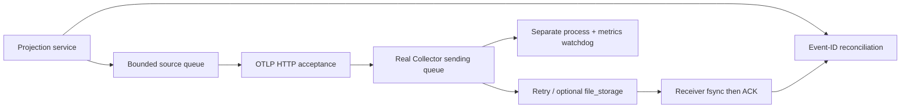

# Telemetry Loss Clinic

[](https://github.com/JDinSeattle/telemetry-loss-clinic/actions/workflows/ci.yml)

A real OpenTelemetry Collector failure laboratory with an explicit Python export queue, a small projection service, and a self-written OTLP/HTTP receiver that fsyncs each accepted log before acknowledging it. Fixed event IDs make every source drop, unacknowledged export, duplicate and acknowledged-but-missing event inspectable.

Ten experiments exercise normal delivery, receiver outage, connection disconnect, HTTP 429, delayed ACK, memory queue SIGKILL, persistent queue SIGKILL, Collector queue overflow, persistent file capacity, and source queue overflow. This uses the **real contrib 0.147.0 binary**, including `file_storage`; it does not simulate Collector retry logic. The source writer is explicit custom OTLP code, **not the official Python SDK**.

In the recorded crash pair, all 30 acknowledged memory-queued logs are missing after restart while the persistent run delivers all 30. Delaying ACK after fsync creates duplicates. A 256 KiB file limit produces real EFBIG errors and acknowledged data loss: persistence is not an unconditional zero-loss guarantee.

## Reproduce

```bash
git clone https://github.com/JDinSeattle/telemetry-loss-clinic.git
cd telemetry-loss-clinic
make verify
python3 evidence.py .runs/latest
```

`make test` runs focused contract regressions. `make verify` also builds and executes real integration/fault experiments. A prior `.runs/latest` is moved to a timestamped archive before a fresh run; nonempty output directories outside `.runs` are never overwritten. GitHub Actions executes the same entry point and uploads evidence even on failure.

The checked-in [local evidence](evidence/local/) has raw records, a source/environment manifest and SHA-256 artifact hashes. Verify it with `make evidence-check`. [Measured results](docs/results.md), [engineering notes](docs/engineering.md), and [interview guide](docs/interview.md) explain what can be claimed.

## System



No batch processor is inserted before the persistent exporter: its volatile pre-queue window would invalidate the deliberately isolated crash experiment. One event per request makes queue and ACK accounting auditable. `file_storage` and the configured HTTP exporter are tested by actual startup and transport; the binary's component listing omits some core exporters, so startup is part of the capability check.

## Support and evidence limits

Linux x86_64, Python ≥3.10, internet on first run to fetch the checksum-pinned 342 MiB Collector binary. No Docker/root required. Ten small diagnostic scenarios at a 100 events/s target (30 events each), with an explicitly unpaced source-overflow burst; this is not a sustained throughput qualification. Reported delivery rate includes recovery/observation time. Wall-clock latency is meaningful because all processes share one clock. RSS and queue peaks are sampled lower bounds. The storage fault is child-only RLIMIT_FSIZE/EFBIG, not ENOSPC, power loss or filesystem corruption. No Kafka, no OTel language SDK, no official Go API coverage. The batch-processor stage is deliberately excluded. Source queue acceptance is volatile; Collector HTTP success is not downstream durability; sink fsync cannot remove ACK ambiguity.


**Role evidence:** Observability · platform reliability · SDET. This is an author-operated engineering lab. AI-assisted implementation is disclosed; ownership means understanding, reproducing and explaining the code and measurements. No external customer, production operation, upstream contribution or independent reviewer is implied.

MIT licensed. Operator source vendoring, where present, is recorded in `vendor/lock.json`; upstream workload attribution, where present, is in `upstream/`.
