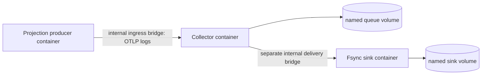

# Container integration and recovery

This adds actual local Docker Engine integration to the native Collector campaigns. It uses Collector 0.160.0; the native entry point still qualifies both 0.147.0 and 0.160.0. Hosted CI repeats the container campaign independently. No AWS/cloud-service deployment or production traffic is inferred.



The two bridges allow the harness to disconnect Collector delivery while preserving producer-to-Collector admission. No application ports are published on the host. Fault control is a test-owned file changed through `docker compose exec`, not an unauthenticated HTTP control endpoint. The Docker socket remains on the host and is never mounted into a container.

## Run

Requirements: Linux amd64 Docker Engine, Compose with `--wait`, cgroup v2 and Python 3.12+ on the host. The measured host used Docker 29.8.0 / Compose 5.3.1; CI records its actual engine version separately. Initial builds require access to the two pinned official image registries.

```bash
make container-verify
python3 evidence.py .runs/container
```

The command creates a random `cc-telemetry-*` Compose project, builds images, runs real failure cases, retains raw commands/results, and removes only its own containers, networks, volumes and image tags. Existing results are archived under `.runs` before rerunning. Failed runs also preserve diagnostics and cleanup status. No global Docker prune or daemon reconfiguration is used.

For manual exploration:

```bash
make container-up
docker compose run --rm producer python container/app.py produce --prefix demo-001
make container-down
```

Use a new prefix for a new source run. Manual shutdown preserves the named data volumes; the automated campaign intentionally creates and removes fresh test-only volumes.

## Acceptance contracts

Each scenario makes 30 event attempts, with application computations and explicit custom OTLP source exports recorded. It is not the official Python SDK.

1. Normal: all accepted/acknowledged IDs reach the fsync sink.
2. Network partition: disconnect the actual delivery bridge; prove no scenario ID reached the sink before reconnecting, then reconcile recovery.
3. Collector recreation: block the sink, confirm all 30 source exports were acknowledged, SIGKILL the Collector, replace its container while retaining the same named queue volume, then restore delivery and reconcile IDs.
4. Sink recreation: replace the sink container and require exact preservation of previous disk-backed records; deliver another 30 events.
5. Delayed ACK: fsync before deliberately delaying the response; require duplicate delivery to remain visible.

The runner checks actual UID, capabilities, `NoNewPrivs`, a failed write to a user-owned file on the read-only root, and cgroup CPU/memory/swap/PID values. The Collector is limited to 512 MiB; sink/producer to 128 MiB, with a 0.5 CPU quota and 64 PID limit. The harness verifies configured resource boundaries; only D runs an intentional memory exhaustion probe.

## Image and operational choices

The Python 3.14.7 Debian runtime and official Collector 0.160.0 image are pinned by OCI digest in the Dockerfile. The Collector executable copied from the official image must additionally match the exact native campaign SHA-256. A Python-equipped Collector image supports health probes and readable test diagnostics; this is a validation-lab image, not a claim of a minimum-size production distribution. All containers run as UID/GID 10001, with dropped capabilities, no-new-privileges, read-only root and small writable tmpfs. Writable named volumes are explicitly owned by that UID.

Compose startup uses `service_healthy`, and health checks query actual HTTP endpoints. The Collector health endpoint does not mean downstream fsync delivery is healthy: the partition experiment deliberately distinguishes those boundaries. Queue batching is explicitly disabled to retain one-event-per-request semantics. Readiness and ordering follow [Docker's startup guidance](https://docs.docker.com/compose/how-tos/startup-order/); runtime limits use the [Compose service fields](https://docs.docker.com/reference/compose-file/services/).

## Evidence boundaries

[Measured container results](container-results.md) and `evidence/containers-20260907/` preserve raw source/sink IDs, container/image identities, recreated-volume names, hardening probes and scoped cleanup. The original native evidence stays unchanged. Clean container recreation on one host is not disk power-loss testing, persistent-format migration, multi-host fault tolerance or an exactly-once guarantee. Other native EFBIG tests still demonstrate acknowledged loss. No comparative throughput improvement is claimed.
