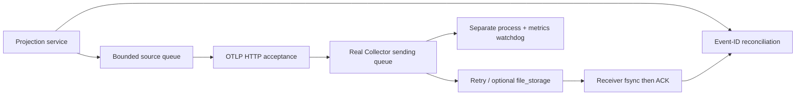

# Engineering contract

No batch processor is inserted before the persistent exporter: its volatile pre-queue window would invalidate the deliberately isolated crash experiment. One event per request makes queue and ACK accounting auditable. `file_storage` and the configured HTTP exporter are tested by actual startup and transport; the binary's component listing omits some core exporters, so startup is part of the capability check.

## Compatibility and limits

Linux x86_64, Python ≥3.10, internet on first run to fetch the checksum-pinned 342 MiB Collector binary. No Docker/root required. Ten small diagnostic scenarios at a 100 events/s target (30 events each), with an explicitly unpaced source-overflow burst; this is not a sustained throughput qualification. Reported delivery rate includes recovery/observation time. Wall-clock latency is meaningful because all processes share one clock. RSS and queue peaks are sampled lower bounds. The storage fault is child-only RLIMIT_FSIZE/EFBIG, not ENOSPC, power loss or filesystem corruption. No Kafka, no OTel language SDK, no official Go API coverage. The batch-processor stage is deliberately excluded. Source queue acceptance is volatile; Collector HTTP success is not downstream durability; sink fsync cannot remove ACK ambiguity.

## ACK ledger and loss oracle

| Boundary | Meaning of acceptance | Failure semantics |
|---|---|---|
| `Source.publish` | event ID and creation timestamp are in a bounded volatile application queue | full queue rejects newest event; caller keeps record |
| source exporter | OTLP HTTP 200 with zero `partialSuccess.rejectedLogRecords` | no implicit client retry; non-200/partial failure retained |
| Collector in-memory queue | exporter accepted telemetry for asynchronous sending | SIGKILL loses pending records |
| Collector file_storage queue | persistent sending queue accepted a record | storage exhaustion and implementation recovery semantics can still lose data |
| receiving oracle | JSONL flushed and fsynced before ACK | lost/delayed ACK can cause repeated fsync of same event |

`acknowledged_missing` is a set difference, not inferred from HTTP errors. `delivered_without_ack` handles an ambiguous upstream failure. Recovered events retain original source timestamps; `late_replay_records` separates post-recovery arrivals from real-time traffic. A separate watcher records process liveness and metrics reachability during kill/restart so missing observations cannot be interpreted as a healthy service.

The Python projection workload returns an output digest and kernel/enqueue/handler timings for every request. A 60-pair on/off study records instrumentation enqueue cost independently of SDK/export delivery. Raw collector CPU tick samples, RSS samples, Prometheus queue size/capacity and exporter counters remain in `resources.jsonl`. Queue peaks are sampled, not exact continuous maxima. Source-overflow is deliberately unpaced and is named as such.

To feed actual D service audit records, `python3 scripts/relay_service_log.py path/to/service.jsonl http://127.0.0.1:4318 --out .runs/replay.json` preserves IDs with a replay prefix and explicitly labels the traffic historical. It does not pretend historical replay occurred at the original request time.

## Storage result interpretation

The controlled 256 KiB file limit produces `file resize error ... file too large` in the real storage component. This is EFBIG, not ENOSPC. Queued acknowledgements and downstream arrivals can diverge before the file reaches a recoverable steady state. The report preserves the missing IDs and raw exporter errors instead of asserting WAL equals durability under every fault. The 1.2 s quiescence window and 5 s observation deadline are part of the workload contract; pending records are not reclassified as successful.

References: [Collector resilience](https://opentelemetry.io/docs/collector/resiliency/), [pinned release](https://github.com/open-telemetry/opentelemetry-collector-releases/releases/tag/v0.147.0).
